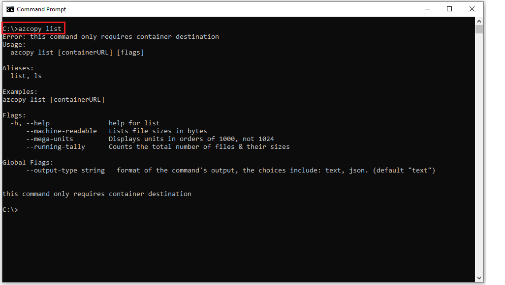

# AzCopy v10
AzCopy v10 is a command-line utility that you can use to copy data to and from containers and file shares in Azure Storage accounts.
AzCopy V10 presents easy-to-use commands that are optimized for high performance and throughput.

## Features and capabilities

:white_check_mark: Use with storage accounts that have a hierarchical namespace (Azure Data Lake Storage Gen2).

:white_check_mark: Create containers and file shares.

:white_check_mark: Upload files and directories.

:white_check_mark: Download files and directories.

:white_check_mark: Copy containers, directories and blobs between storage accounts (Service to Service).

:white_check_mark: Synchronize data between Local <=> Blob Storage, Blob Storage <=> File Storage, and Local <=> File Storage.

:white_check_mark: Delete blobs or files from an Azure storage account

:white_check_mark: Copy objects, directories, and buckets from Amazon Web Services (AWS) to Azure Blob Storage (Blobs only).

:white_check_mark: Copy objects, directories, and buckets from Google Cloud Platform (GCP) to Azure Blob Storage (Blobs only).

:white_check_mark: List files in a container.

:white_check_mark: Recover from failures by restarting previous jobs.

## Download AzCopy
The latest binary for AzCopy along with installation instructions may be found
[here](https://docs.microsoft.com/en-us/azure/storage/common/storage-use-azcopy-v10).

## Find help

For complete guidance, visit any of these articles on the docs.microsoft.com website.

:eight_spoked_asterisk: [Get started with AzCopy (download links here)](https://docs.microsoft.com/azure/storage/common/storage-use-azcopy-v10)

:eight_spoked_asterisk: [Upload files to Azure Blob storage by using AzCopy](https://docs.microsoft.com/en-us/azure/storage/common/storage-use-azcopy-blobs-upload)

:eight_spoked_asterisk: [Download blobs from Azure Blob storage by using AzCopy](https://docs.microsoft.com/en-us/azure/storage/common/storage-use-azcopy-blobs-download)

:eight_spoked_asterisk: [Copy blobs between Azure storage accounts by using AzCopy](https://docs.microsoft.com/en-us/azure/storage/common/storage-use-azcopy-blobs-copy)

:eight_spoked_asterisk: [Synchronize between Local File System/Azure Blob Storage (Gen1)/Azure File Storage by using AzCopy](https://docs.microsoft.com/en-us/azure/storage/common/storage-use-azcopy-blobs-synchronize)

:eight_spoked_asterisk: [Transfer data with AzCopy and file storage](https://docs.microsoft.com/en-us/azure/storage/common/storage-use-azcopy-files)

:eight_spoked_asterisk: [Transfer data with AzCopy and Amazon S3 buckets](https://docs.microsoft.com/en-us/azure/storage/common/storage-use-azcopy-s3)

:eight_spoked_asterisk: [Transfer data with AzCopy and Google GCP buckets](https://docs.microsoft.com/en-us/azure/storage/common/storage-use-azcopy-google-cloud)

:eight_spoked_asterisk: [Use data transfer tools in Azure Stack Hub Storage](https://docs.microsoft.com/en-us/azure-stack/user/azure-stack-storage-transfer)

:eight_spoked_asterisk: [Configure, optimize, and troubleshoot AzCopy](https://docs.microsoft.com/azure/storage/common/storage-use-azcopy-configure)

:eight_spoked_asterisk: [AzCopy WiKi](https://github.com/Azure/azure-storage-azcopy/wiki)

## Supported Operations

The general format of the AzCopy commands is: `azcopy [command] [arguments] --[flag-name]=[flag-value]`

* `bench` - Runs a performance benchmark by uploading or downloading test data to or from a specified destination

* `copy` - Copies source data to a destination location. The supported directions and forms of authorization are:
    - local <-> Azure Blob (Microsoft Entra ID or Shared access signature (SAS))
    - local <-> Azure Files SMB (Microsoft Entra ID or Share/directory SAS)
    - local <-> Azure Files NFS (Microsoft Entra ID or Share/directory SAS)
    - local <-> Azure Data Lake Storage (Microsoft Entra ID, SAS, or Shared Key)
    - Azure Blob (Microsoft Entra ID, SAS, public) -> Azure Blob (Microsoft Entra ID or SAS)
    - Data Lake Storage (Microsoft Entra ID or SAS) <-> Data Lake Storage (Microsoft Entra ID or SAS)
    - Data Lake Storage (Microsoft Entra ID or SAS) <-> Azure Blob (Microsoft Entra ID or SAS)
    - Azure Blob (Microsoft Entra ID, SAS or public) -> Azure Files SMB (Microsoft Entra ID or SAS)
    - Azure Files SMB (Microsoft Entra ID or SAS) -> Azure Files SMB (Microsoft Entra ID or SAS)
    - Azure Files SMB (Microsoft Entra ID or SAS) -> Azure Blob (Microsoft Entra ID or SAS)
    - Azure Files NFS (Microsoft Entra ID or SAS) -> Azure Files NFS (Microsoft Entra ID or SAS)
    - AWS S3 (Access Key) -> Azure Block Blob (Microsoft Entra ID or SAS)
    - Google Cloud Storage (Service Account Key) -> Azure Block Blob (Microsoft Entra ID or SAS)

* `sync` - Replicate source to the destination location. The supported directions and forms of authorization are:
    - Local <-> Azure Blob / Azure File (Microsoft Entra ID or SAS)
    - Azure Blob <-> Azure Blob (Microsoft Entra ID or SAS)
    - Azure Data Lake Storage <-> Azure Data Lake Storage (Microsoft Entra ID or SAS)
    - Azure File <-> Azure File (Source must include a SAS or is publicly accessible; SAS authorization should be used for destination)
    - Azure Blob <-> Azure File

* `login` - Log in to Azure Active Directory (AD) to access Azure Storage resources.

* `logout` - Log out to terminate access to Azure Storage resources.

* `list` - List the entities in a given resource

* `doc` - Generates documentation for the tool in Markdown format

* `env` - Shows the environment variables that you can use to configure the behavior of AzCopy.

* `help` - Help about any command

* `jobs` - Sub-commands related to managing jobs

* `load` - Sub-commands related to transferring data in specific formats

* `make` - Create a container or file share.

* `remove` - Delete blobs or files from an Azure storage account

## Find help from your command prompt

For convenience, consider adding the AzCopy directory location to your system path for ease of use. That way you can type `azcopy` from any directory on your system.

To see a list of commands, type `azcopy -h` and then press the ENTER key.

To learn about a specific command, just include the name of the command (For example: `azcopy list -h`).

If you choose not to add AzCopy to your path, you'll have to change directories to the location of your AzCopy executable and type `azcopy` or `.\azcopy` in Windows PowerShell command prompts.

## Frequently asked questions

### What is the difference between `sync` and `copy`?

* The `copy` command is a simple transferring operation. It scans/enumerates the source and attempts to transfer every single file/blob present on the source to the destination.
  The supported source/destination pairs are listed in the help message of the tool.

* On the other hand, `sync` scans/enumerates both the source, and the destination to find the incremental change.
  It makes sure that whatever is present in the source will be replicated to the destination. For `sync`,

* If your goal is to simply move some files, then `copy` is definitely the right command, since it offers much better performance.
  If the use case is to incrementally transfer data (files present only on source) then `sync` is the better choice, since only the modified/missing files will be transferred.
  Since `sync` enumerates both source and destination to find the incremental change, it is relatively slower as compared to `copy`

### Will `copy` overwrite my files?

By default, AzCopy will overwrite the files at the destination if they already exist. To avoid this behavior, please use the flag `--overwrite=false`.

### Will `sync` overwrite my files?

By default, AzCopy `sync` use last-modified-time to determine whether to transfer the same file present at both the source, and the destination.
i.e, If the source file is newer compared to the destination file, we overwrite the destination
You can change this default behaviour and overwrite files at the destination by using the flag `--mirror-mode=true`

### Will 'sync' delete files in the destination if they no longer exist in the source location?

By default, the 'sync' command doesn't delete files in the destination unless you use an optional flag with the command.
To learn more, see [Synchronize files](https://docs.microsoft.com/en-us/azure/storage/common/storage-use-azcopy-blobs-synchronize).

## How to contribute to AzCopy v10

This project welcomes contributions and suggestions.  Most contributions require you to agree to a
Contributor License Agreement (CLA) declaring that you have the right to, and actually do, grant us
the rights to use your contribution. For details, visit https://cla.microsoft.com.

When you submit a pull request, a CLA-bot will automatically determine whether you need to provide
a CLA and decorate the PR appropriately (e.g., label, comment). Simply follow the instructions
provided by the bot. You will only need to do this once across all repos using our CLA.

This project has adopted the [Microsoft Open Source Code of Conduct](https://opensource.microsoft.com/codeofconduct/).
For more information see the [Code of Conduct FAQ](https://opensource.microsoft.com/codeofconduct/faq/) or
contact [opencode@microsoft.com](mailto:opencode@microsoft.com) with any additional questions or comments.
