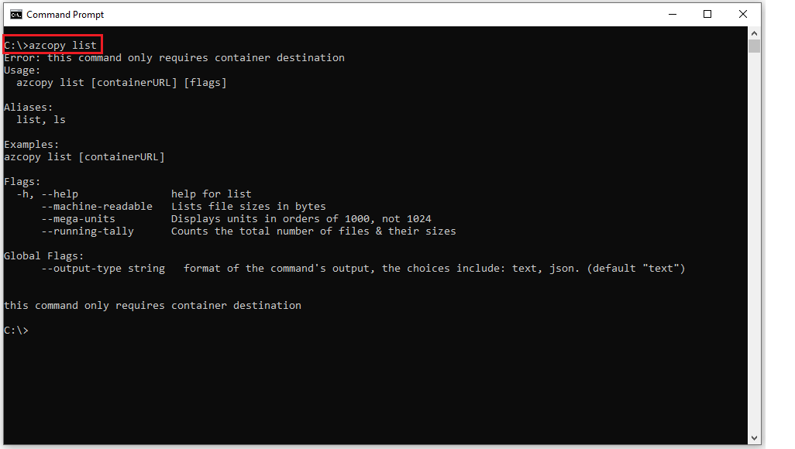

# AzCopy v10
AzCopy v10 is a command-line utility that you can use to copy data to and from containers and file shares in Azure Storage accounts.
AzCopy V10 presents easy-to-use commands that are optimized for high performance and throughput.

## Features and capabilities

:white_check_mark: Use with storage accounts that have a hierarchical namespace (Azure Data Lake Storage Gen2).

:white_check_mark: Create containers and file shares.

:white_check_mark: Upload files and directories.

:white_check_mark: Download files and directories.

:white_check_mark: Copy containers, directories and blobs between storage accounts (Service to Service).

:white_check_mark: Synchronize data between Local <=> Blob Storage, Blob Storage <=> File Storage, and Local <=> File Storage.

:white_check_mark: Delete blobs or files from an Azure storage account

:white_check_mark: Copy objects, directories, and buckets from Amazon Web Services (AWS) to Azure Blob Storage (Blobs only).

:white_check_mark: Copy objects, directories, and buckets from Google Cloud Platform (GCP) to Azure Blob Storage (Blobs only).

:white_check_mark: List files in a container.

:white_check_mark: Recover from failures by restarting previous jobs.

## Storage Mover block-dedupe prototype

> [!IMPORTANT]
> This section describes the block-level dedupe prototype in the
> `ProgramPedro/azure-storage-azcopy` fork. It is not part of the supported
> upstream AzCopy release.

This fork adds job-local block deduplication for Azure block-blob to block-blob
service-to-service transfers. Storage Mover embeds the fork as a Go dependency
inside its Linux cloud-to-cloud worker. The worker receives a normal C2C job,
resolves source and destination SAS credentials in memory, and invokes the
embedded AzCopy engine. Dedupe mode is selected by the worker environment; it
is not currently a field in the C2C queue contract.

### High-level architecture

```text
C2C seeder
    |
    | C2CJobRequest (endpoints + SAS secret references, no literal SAS)
    v
jobqueue
    |
    v
Storage Mover orchestrator
    |-- validates the request
    |-- initializes job state
    v
endpointqueue
    |
    v
one-shot Storage Mover worker
    |-- resolves source and destination SAS values
    |-- creates the per-job external data directory
    |-- starts embedded AzCopy with mover,smslidingwindow build tags
    v
ProgramPedro AzCopy fork
    |-- reads source committed blocks and CRC64/SHA256 hashes
    |-- builds the source-grid chunk plan
    |-- looks each block up in the job-local committed hash table
    |-- stages a miss from sourceURI
    |-- stages a hit from an already-committed targetURI
    |-- commits the new destination blob and indexes its blocks
    v
DevFabric Blob endpoints through the test proxy
```

For the local DevFabric E2E, the worker sends Blob requests to the host-style
proxy endpoint. Normal Blob operations are routed to the managed frontend, and
hash-bearing committed-block-list requests are routed to the native frontend
that implements `GetBlockList(include=crc64,sha256)`.

### End-to-end transfer flow

1. The worker receives a Blob-to-Blob C2C job containing account, container,
   endpoint, and SAS secret-reference metadata.
2. Mover resolves both SAS tokens and passes them to AzCopy as runtime-only
   authentication. The values are not serialized into an AzCopy plan file.
3. For an eligible source block blob, AzCopy requests the committed block list
   with `include=crc64,sha256`.
4. AzCopy converts the ordered committed block list into a source-grid plan.
   Each planned block contains its source offset, size, block name, CRC64, and
   SHA256.
5. The normal uniform chunk grid is replaced with one transfer chunk per source
   committed block.
6. Before staging a chunk, AzCopy uses its `(offset, size)` to obtain the source
   block hashes and looks those hashes up in the job's committed dedupe table.
7. On a miss, AzCopy stages the range from the original source URI.
8. On a hit in enforce mode, AzCopy stages the matching range from an
   already-committed destination blob. The copy source is guarded with the
   recorded ETag.
9. If target reuse fails, AzCopy falls back to the original source for that
   block. Dedupe must not turn a reusable-block failure into a transfer failure.
10. After `CommitBlockList` succeeds for the new blob, its hashed blocks,
    destination ranges, and ETag are added to the committed table for later
    blobs in the same job.
11. When the job reaches a terminal state, AzCopy writes the final dedupe
    summary, closes the dedicated dedupe log, clears both in-memory tables, and
    releases their memory.

### Source-grid chunking

Normal AzCopy block-blob transfers use a uniform chunk size selected from the
transfer settings. Uniform chunks do not necessarily align with the source
blob's committed block boundaries, so a uniform chunk may cover part of one
source block and part of another. Its content hash would then be different from
the hashes returned for either committed source block.

The source-grid implementation preserves the source block boundaries:

```text
Committed source block sizes:  4 MiB, 4 MiB, 2 MiB
Derived source ranges:         [0,4), [4,8), [8,10) MiB
Scheduled AzCopy chunks:       [0,4), [4,8), [8,10) MiB
```

`buildSourceGridPlan` uses the offset returned by XStore when it is present.
For compatibility with legacy Azure responses that omit `Offset`, it derives
only the missing value from the preceding block ranges. It rejects negative
offsets, gaps, overlaps, integer overflow, and non-positive block sizes. Before
enabling source-grid chunking for a transfer, the implementation also requires:

- a block-blob to block-blob service-to-service transfer;
- a committed named-block list;
- a complete CRC64 and SHA256 pair for at least one block;
- a plan total equal to the reported source blob size;
- no more than Azure's maximum number of blocks per block blob; and
- a destination SAS in enforce mode, because a hit is read from a destination
  blob.

If any eligibility check fails, the transfer retains the standard uniform grid.
The `sourceGridChunker` interface exposes the content-defined ranges to
`scheduleSendChunks`, and `scheduleSourceGridChunks` schedules them through the
existing S2S copy path.

### Job-local dedupe hash tables

`common.DedupeHashTable` is an in-memory, concurrency-safe table. It is scoped
to one AzCopy job and is never serialized to a plan file, queue message, or
database.

Each `BlockEntry` stores:

| Field | Purpose |
| --- | --- |
| `CRC64` | Fast first-pass bucket key. |
| `SHA256` | Strong equality check within a CRC64 bucket; prevents CRC64 collisions from becoming false hits. |
| `TargetURI` | Authenticated location of the previously committed destination blob. It remains in memory and is sanitized before logging. |
| `TargetOffset` / `TargetLength` | Exact source range for `StageBlockFromURL`. Block IDs cannot be reused across blobs, so reuse occurs by copying this byte range. |
| `ETag` | Version guard supplied as `SourceIfMatch` when staging from the target URI. |
| `RefCount` | Number of insertions of the same fingerprint. |
| `CreatedAt` / `TTL` | Optional expiry metadata. Prototype entries currently use a non-positive TTL and live until job cleanup. |

The table maps CRC64 values to small collision buckets. A lookup first selects
the CRC64 bucket and then requires an exact SHA256 match. Insert and lookup are
protected by an RW mutex. An existing fingerprint increments its reference
count rather than adding a duplicate entry.

The per-job state currently owns two tables:

- `table` is used only by observe mode to measure would-be hits before data is
  written. It must never be used for a real target reference.
- `committed` contains only blocks from destination blobs whose
  `CommitBlockList` operation succeeded. Enforce mode consults only this table.

The first committed occurrence of a fingerprint remains the reusable target.
The implementation rejects missing ETags, invalid ranges, differently-sized
entries, and reuse of the blob currently being written. Consequently, only
content in another already-committed destination blob can be reused.

The table is job-local. Separate jobs, worker restarts, and separate worker
processes do not share candidates.

### Dedupe modes

The current fork retains the prototype diagnostic modes, although the Mover
worker image selects enforce mode:

| Configuration | Behavior |
| --- | --- |
| `AZCOPY_DEDUPE_ACT=enforce` | Uses source-grid chunks and stages a matching block from a committed destination range. Falls back to the original source on reuse failure. |
| `AZCOPY_DEDUPE_ACT=shadow` | Uses the source grid and reports reusable blocks, but still stages all data from the original source. |
| `AZCOPY_DEDUPE_OBSERVE=true` | Read-only alignment and would-be-hit measurement. It does not alter transfer behavior. |
| Variables unset | Standard AzCopy behavior. |

The Storage Mover Dockerfile currently sets
`AZCOPY_DEDUPE_ACT=enforce`. Neither mode value is part of
`C2CJobRequest`.

### Runtime SAS handling

The source and destination SAS values are needed after the SAS-free plan has
been created:

```text
CopyJobPartOrderRequest
    -> ste.AddJobPartArgs (transient SAS fields)
    -> jobPartMgr.sourceSAS / destinationSAS
    -> jobPartTransferMgr.SAS()
    -> source and target StageBlockFromURL calls
```

`jobsAdmin.ExecuteNewCopyJobPartOrder` copies `SourceRoot.SAS` and
`DestinationRoot.SAS` into transient `AddJobPartArgs` fields. `AddJobPart`
copies them into the in-memory `jobPartMgr`. The job plan deliberately stores
only SAS-free roots. Resume continues to obtain fresh SAS values rather than
recovering credentials from a plan file.

For this E2E path:

- the source SAS requires read and list;
- the destination SAS requires read, create, write, delete, and list; and
- destination read is specifically required for target-to-target block reuse.

### Files changed by this prototype

| File | Responsibility |
| --- | --- |
| `common/dedupeHashTable.go` | Defines `BlockEntry` and the concurrency-safe CRC64-bucket/SHA256-confirmed hash table. |
| `common/environment.go` | Defines the internal `AZCOPY_DEDUPE_ACT` and `AZCOPY_DEDUPE_OBSERVE` switches. |
| `common/util.go` | Exposes the configured AzCopy log root used by the dedicated dedupe log writer. |
| `cmd/root.go` | Publishes the initialized log folder to `common.AzcopyLogFolder`. |
| `jobsAdmin/init.go` | Carries source and destination SAS values from the incoming order into transient `AddJobPartArgs`. |
| `ste/mgr-JobMgr.go` | Stores runtime SAS values on each `jobPartMgr` and finalizes/clears dedupe state when the job terminates. |
| `ste/mgr-JobPartTransferMgr.go` | Exposes runtime SAS values to transfer and sender code through `SAS()`. |
| `ste/sourceGridObserver.go` | Defines source-grid plan types and construction, alignment diagnostics, and observe-mode collection. |
| `ste/dedupeAct.go` | Parses act mode, retrieves the extended committed block list, extracts hashes, and produces source-grid chunk specifications. |
| `ste/dedupeRecorder.go` | Owns per-job tables and counters, records committed targets, makes the core hit decision, calculates savings, sanitizes output, and writes external per-job logs. |
| `ste/sender-blockBlobFromURL.go` | Arms dedupe for eligible S2S transfers and chooses source staging, shadow reporting, target reuse, or fallback for each block. |
| `ste/sender-blockBlob.go` | Captures the destination ETag after `CommitBlockList`, indexes the newly committed blocks, and emits file-level progress. |
| `ste/xfer-anyToRemote-file.go` | Invokes observe mode and schedules source-grid chunks through the existing S2S transfer pipeline. |
| `ste/testJobPartTransferManager_test.go` | Extends the test transfer manager for SAS and dedupe test seams. |
| `common/zt_dedupeHashTable_test.go` | Covers insertion, collision buckets, expiry, reference counts, removal, and concurrent access. |
| `jobsAdmin/init_test.go` and `ste/mgr-JobPartMgr_test.go` | Verify runtime SAS reaches the transfer manager while sentinel SAS values remain absent from generated plans; preserve non-SAS and resume behavior. |
| `ste/dedupeAct_test.go` and `ste/dedupeRecorder_test.go` | Cover mode parsing, hash extraction, committed-target recording, hit decisions, fallback counters, summaries, redaction, and external logging. |
| `ste/sourceGridObserver_test.go` | Covers source-grid offset construction and alignment calculations. |

### Building the Mover worker image

Mover consumes this fork as a Go module replacement. Its `xdatamoved/go.mod`
must require the published AzCopy pseudo-version and replace the upstream module
with the same version from this fork. It must also retain the ProgramPedro
`azblob` replacement that defines the extended block-list hash fields.

Conceptually:

```go
require github.com/Azure/azure-storage-azcopy/v10 <azcopy-pseudo-version>

replace github.com/Azure/azure-storage-azcopy/v10 => github.com/ProgramPedro/azure-storage-azcopy/v10 <azcopy-pseudo-version>

replace github.com/Azure/azure-sdk-for-go/sdk/storage/azblob => github.com/ProgramPedro/azure-sdk-for-go/sdk/storage/azblob <azblob-pseudo-version>
```

From the Mover repository root, build the Linux worker with:

```bash
docker build \
  --tag mover-worker:dedupe \
  --file xdatamoved/cloud2cloud/worker/Dockerfile \
  .
```

The worker Dockerfile compiles with the `mover,smslidingwindow` build tags,
sets `FEATURE_MODE=CLOUD_TO_CLOUD`, and currently sets
`AZCOPY_DEDUPE_ACT=enforce`. The AzCopy and azblob commits must be pushed before
building from pseudo-versions; a local unpushed commit cannot be downloaded by
the Docker builder.

### External dedupe logs

Mover creates a persistent per-job data folder below its worker file-share
mount. Embedded AzCopy uses the `azcopy` child directory as its log root. This
fork lazily creates a dedicated log file on the first dedupe event:

```text
/mnt/clpfileshare/
  <jobDefinitionId>/
    <jobRunId>/
      azcopy/
        dedupe-logs/
          <AzCopyJobID>.log
```

The filename contains the AzCopy job ID. The surrounding directories identify
the Mover job definition and run.

To access the file outside the Linux container, bind-mount or otherwise
persist `/mnt/clpfileshare`. Include this mount in the complete worker launch
configuration:

```bash
docker run \
  --mount type=bind,source=<host-log-root>,target=/mnt/clpfileshare \
  mover-worker:dedupe
```

On a Windows host, the resulting file is available under:

```text
<host-log-root>\<jobDefinitionId>\<jobRunId>\azcopy\dedupe-logs\<AzCopyJobID>.log
```

The file is append-only and can be read while the transfer is active:

```powershell
$log = Get-ChildItem <host-log-root> -Recurse -Filter *.log |
  Where-Object FullName -Match '[\\/]azcopy[\\/]dedupe-logs[\\/]' |
  Sort-Object LastWriteTime -Descending |
  Select-Object -First 1

Get-Content $log.FullName -Wait
```

Progress events begin with `DEDUPE_PROGRESS` and use stable key/value fields.
Important events include:

| Event | Meaning |
| --- | --- |
| `file_start` | Source-grid dedupe was armed for a blob. |
| `small_file_transfer_start` | A Blob-to-Blob file smaller than 4 MiB entered transfer handling. Includes its size and cumulative small-file progress. |
| `small_file_transfer_complete` | A file smaller than 4 MiB completed successfully. |
| `small_file_transfer_failed` | A file smaller than 4 MiB completed with a failure status. |
| `small_file_transfer_skipped` | A file smaller than 4 MiB was skipped by transfer policy. |
| `small_file_transfer_canceled` | A file smaller than 4 MiB was canceled. |
| `source_block_transferred` | A block was staged from the original source URI. |
| `target_reuse_candidate` | Shadow mode found a reusable committed target. |
| `target_reuse` | Enforce mode successfully staged a block from a target URI. |
| `target_reuse_fallback` | Target reuse failed and the block will be staged from the source. |
| `file_committed` | The destination blob committed and its eligible blocks were indexed. |
| `job_complete` | Final cumulative block, byte, fallback, and WAN-savings counters. |
| `output_dropped` | The bounded asynchronous log queue was full; transfer work continued without blocking. |

Per-block transfer goroutines enqueue events into a bounded asynchronous queue,
so a slow host-mounted log volume does not directly block data staging. The
terminal event waits for a bounded flush and then closes the job's writer.
Files rotate at 500 MiB. URLs are written without query strings, and the AzCopy
log sanitizer provides an additional backstop for SAS signatures and tokens.

Small-file events use a strict `< 4 MiB` threshold. Their cumulative fields
include started, completed, failed, skipped, canceled, and in-progress file and
byte counts. These fields are appended alongside the existing block-level
dedupe and WAN-savings counters, so one log shows both small-file transfer
progress and dedupe reuse progress.

### Current limitations

- Dedupe supports block-blob to block-blob S2S transfers only.
- A source blob created with a single `PutBlob`, or a committed block list with
  no complete hash pairs, is not eligible.
- Candidates are shared only within one in-memory AzCopy job.
- A worker restart loses the committed table. SAS values can be refreshed for
  resume, but the dedupe candidate index is not persisted.
- Separate Storage Mover jobs cannot share destination candidates.
- Only already-committed destination blobs are reusable. A concurrently written
  or same-target blob is not a valid source.
- Scheduling order and concurrency affect which destination blobs have
  committed early enough to serve as candidates.
- The custom `azblob` extension and hash-enabled DevFabric frontend are required.

## Download AzCopy
The latest binary for AzCopy along with installation instructions may be found
[here](https://docs.microsoft.com/en-us/azure/storage/common/storage-use-azcopy-v10).

## Find help

For complete guidance, visit any of these articles on the docs.microsoft.com website.

:eight_spoked_asterisk: [Get started with AzCopy (download links here)](https://docs.microsoft.com/azure/storage/common/storage-use-azcopy-v10)

:eight_spoked_asterisk: [Upload files to Azure Blob storage by using AzCopy](https://docs.microsoft.com/en-us/azure/storage/common/storage-use-azcopy-blobs-upload)

:eight_spoked_asterisk: [Download blobs from Azure Blob storage by using AzCopy](https://docs.microsoft.com/en-us/azure/storage/common/storage-use-azcopy-blobs-download)

:eight_spoked_asterisk: [Copy blobs between Azure storage accounts by using AzCopy](https://docs.microsoft.com/en-us/azure/storage/common/storage-use-azcopy-blobs-copy)

:eight_spoked_asterisk: [Synchronize between Local File System/Azure Blob Storage (Gen1)/Azure File Storage by using AzCopy](https://docs.microsoft.com/en-us/azure/storage/common/storage-use-azcopy-blobs-synchronize)

:eight_spoked_asterisk: [Transfer data with AzCopy and file storage](https://docs.microsoft.com/en-us/azure/storage/common/storage-use-azcopy-files)

:eight_spoked_asterisk: [Transfer data with AzCopy and Amazon S3 buckets](https://docs.microsoft.com/en-us/azure/storage/common/storage-use-azcopy-s3)

:eight_spoked_asterisk: [Transfer data with AzCopy and Google GCP buckets](https://docs.microsoft.com/en-us/azure/storage/common/storage-use-azcopy-google-cloud)

:eight_spoked_asterisk: [Use data transfer tools in Azure Stack Hub Storage](https://docs.microsoft.com/en-us/azure-stack/user/azure-stack-storage-transfer)

:eight_spoked_asterisk: [Configure, optimize, and troubleshoot AzCopy](https://docs.microsoft.com/azure/storage/common/storage-use-azcopy-configure)

:eight_spoked_asterisk: [AzCopy WiKi](https://github.com/Azure/azure-storage-azcopy/wiki)

## Supported Operations

The general format of the AzCopy commands is: `azcopy [command] [arguments] --[flag-name]=[flag-value]`

* `bench` - Runs a performance benchmark by uploading or downloading test data to or from a specified destination

* `copy` - Copies source data to a destination location. The supported directions are:
    - Local File System <-> Azure Blob (SAS or OAuth authentication)
    - Local File System <-> Azure Files (Share/directory SAS or OAuth authentication)
    - Local File System <-> Azure Data Lake Storage (ADLS Gen2) (SAS, OAuth, or SharedKey authentication)
    - Azure Blob (SAS, OAuth or public authentication) -> Azure Blob (SAS or OAuth authentication)
    - Azure Blob (SAS, OAuth or public authentication) -> Azure Files (SAS or OAuth authentication)
    - Azure Files (SAS or OAuth authentication) -> Azure Files (SAS or OAuth authentication)
    - Azure Files (SAS or OAuth authentication) -> Azure Blob (SAS or OAuth authentication)
    - AWS S3 (Access Key) -> Azure Block Blob (SAS or OAuth authentication)
    - Google Cloud Storage (Service Account Key) -> Azure Block Blob (SAS or OAuth authentication) [Preview]

* `sync` - Replicate source to the destination location. The supported directions are:
    - Local File System <-> Azure Blob (SAS or OAuth authentication)
    - Local File System <-> Azure Files (Share/directory SAS or OAuth authentication)
    - Azure Blob (SAS, OAuth or public authentication) -> Azure Files (SAS or OAuth authentication)

* `login` - Log in to Azure Active Directory (AD) to access Azure Storage resources.

* `logout` - Log out to terminate access to Azure Storage resources.

* `list` - List the entities in a given resource

* `doc` - Generates documentation for the tool in Markdown format

* `env` - Shows the environment variables that you can use to configure the behavior of AzCopy.

* `help` - Help about any command

* `jobs` - Sub-commands related to managing jobs

* `load` - Sub-commands related to transferring data in specific formats

* `make` - Create a container or file share.

* `remove` - Delete blobs or files from an Azure storage account

## Find help from your command prompt

For convenience, consider adding the AzCopy directory location to your system path for ease of use. That way you can type `azcopy` from any directory on your system.

To see a list of commands, type `azcopy -h` and then press the ENTER key.

To learn about a specific command, just include the name of the command (For example: `azcopy list -h`).



If you choose not to add AzCopy to your path, you'll have to change directories to the location of your AzCopy executable and type `azcopy` or `.\azcopy` in Windows PowerShell command prompts.

## Frequently asked questions

### What is the difference between `sync` and `copy`?

* The `copy` command is a simple transferring operation. It scans/enumerates the source and attempts to transfer every single file/blob present on the source to the destination.
  The supported source/destination pairs are listed in the help message of the tool.

* On the other hand, `sync` scans/enumerates both the source, and the destination to find the incremental change.
  It makes sure that whatever is present in the source will be replicated to the destination. For `sync`,

* If your goal is to simply move some files, then `copy` is definitely the right command, since it offers much better performance.
  If the use case is to incrementally transfer data (files present only on source) then `sync` is the better choice, since only the modified/missing files will be transferred.
  Since `sync` enumerates both source and destination to find the incremental change, it is relatively slower as compared to `copy`

### Will `copy` overwrite my files?

By default, AzCopy will overwrite the files at the destination if they already exist. To avoid this behavior, please use the flag `--overwrite=false`.

### Will `sync` overwrite my files?

By default, AzCopy `sync` use last-modified-time to determine whether to transfer the same file present at both the source, and the destination.
i.e, If the source file is newer compared to the destination file, we overwrite the destination
You can change this default behaviour and overwrite files at the destination by using the flag `--mirror-mode=true`

### Will 'sync' delete files in the destination if they no longer exist in the source location?

By default, the 'sync' command doesn't delete files in the destination unless you use an optional flag with the command.
To learn more, see [Synchronize files](https://docs.microsoft.com/en-us/azure/storage/common/storage-use-azcopy-blobs-synchronize).

## How to contribute to AzCopy v10

This project welcomes contributions and suggestions.  Most contributions require you to agree to a
Contributor License Agreement (CLA) declaring that you have the right to, and actually do, grant us
the rights to use your contribution. For details, visit https://cla.microsoft.com.

When you submit a pull request, a CLA-bot will automatically determine whether you need to provide
a CLA and decorate the PR appropriately (e.g., label, comment). Simply follow the instructions
provided by the bot. You will only need to do this once across all repos using our CLA.

This project has adopted the [Microsoft Open Source Code of Conduct](https://opensource.microsoft.com/codeofconduct/).
For more information see the [Code of Conduct FAQ](https://opensource.microsoft.com/codeofconduct/faq/) or
contact [opencode@microsoft.com](mailto:opencode@microsoft.com) with any additional questions or comments.
