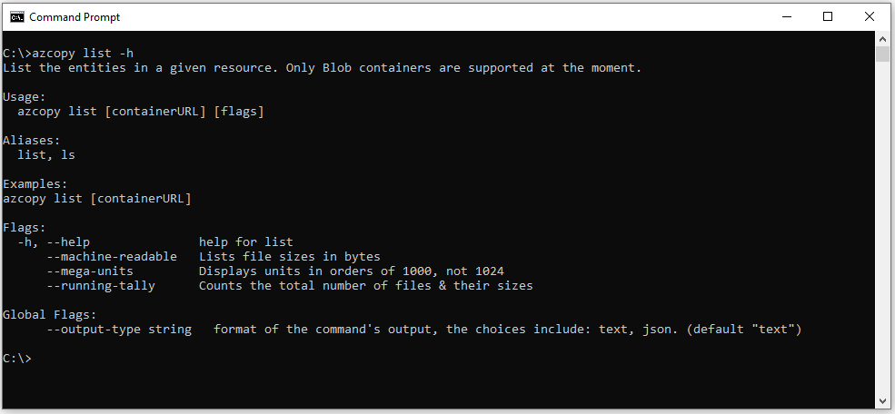

# AzCopy v10

AzCopy v10 is a command-line utility that you can use to copy data to and from containers and file shares in Azure Storage accounts. AzCopy V10 presents easy-to-use commands that are optimized for performance.

## Features and capabilities

:white_check_mark: Use with storage accounts that have a hierarchical namespace (Azure Data Lake Storage Gen2).

:white_check_mark: Create containers and file shares.

:white_check_mark: Upload files and directories.

:white_check_mark: Download files and directories.

:white_check_mark: Copy containers, directories and blobs between storage accounts (Blobs only).

:white_check_mark: Synchronize containers with local file systems and visa versa (Blobs only).

:white_check_mark: Copy objects, directories, and buckets from Amazon Web Services (AWS) (Blobs only).

:white_check_mark: List files in a container (Blobs only).

:white_check_mark: Remove files from a container (Blobs only).

:white_check_mark: Recover from failures by restarting previous jobs.

## Find help

For complete guidance, visit any of these articles on the docs.microsoft.com website.

:eight_spoked_asterisk: [Get started with AzCopy (download links here)](https://docs.microsoft.com/azure/storage/common/storage-use-azcopy-v10)

:eight_spoked_asterisk: [Transfer data with AzCopy and blob storage](https://docs.microsoft.com/azure/storage/common/storage-use-azcopy-blobs)

:eight_spoked_asterisk: [Transfer data with AzCopy and file storage](https://docs.microsoft.com/azure/storage/common/storage-use-azcopy-files)

:eight_spoked_asterisk: [Transfer data with AzCopy and Amazon S3 buckets](https://docs.microsoft.com/azure/storage/common/storage-use-azcopy-s3)

:eight_spoked_asterisk: [Configure, optimize, and troubleshoot AzCopy](https://docs.microsoft.com/azure/storage/common/storage-use-azcopy-configure)

### Find help from your command prompt

For convenience, consider adding the AzCopy directory location to your system path for ease of use. That way you can type `azcopy` from any directory on your system.

To see a list of commands, type `azcopy -h` and then press the ENTER key.

To learn about a specific command, just include the name of the command (For example: `azcopy list -h`).

If you choose not to add AzCopy to your path, you'll have to change directories to the location of your AzCopy executable and type `azcopy` or `.\azcopy` in Windows PowerShell command prompts.

## Frequently asked questions

### What is the difference between `sync` and `copy`?

The `copy` command is a simple transferring operation, it scans the source and attempts to transfer every single file/blob. The supported source/destination pairs are listed in the help message of the tool. On the other hand, `sync` makes sure that whatever is present in the source will be replicated to the destination. If your goal is to simply move some files, then `copy` is definitely the right command, since it offers much better performance.

For `sync`, last modified times are used to determine whether to transfer the same file present at both the source and the destination. If the use case is to incrementally transfer data
then `sync` is the better choice, since only the modified/missing files are transferred.

### Will `copy` overwrite my files?

By default, AzCopy will overwrite the files at the destination if they already exist. To avoid this behavior, please use the flag `--overwrite=false`.

### Will 'sync' delete files in the destination if they no longer exist in the source location?

By default, the 'sync' command doesn't delete files in the destination unless you use an optional flag with the command. To learn more, see [Synchronize files](https://docs.microsoft.com/azure/storage/common/storage-use-azcopy-blobs#synchronize-files).

## Download AzCopy
The latest binary install for AzCopy along with installation instructions may be found
[here](https://docs.microsoft.com/en-us/azure/storage/common/storage-use-azcopy-v10).

## How to contribute to AzCopy v10

This project welcomes contributions and suggestions.  Most contributions require you to agree to a
Contributor License Agreement (CLA) declaring that you have the right to, and actually do, grant us
the rights to use your contribution. For details, visit https://cla.microsoft.com.

When you submit a pull request, a CLA-bot will automatically determine whether you need to provide
a CLA and decorate the PR appropriately (e.g., label, comment). Simply follow the instructions
provided by the bot. You will only need to do this once across all repos using our CLA.

This project has adopted the [Microsoft Open Source Code of Conduct](https://opensource.microsoft.com/codeofconduct/).
For more information see the [Code of Conduct FAQ](https://opensource.microsoft.com/codeofconduct/faq/) or
contact [opencode@microsoft.com](mailto:opencode@microsoft.com) with any additional questions or comments.
