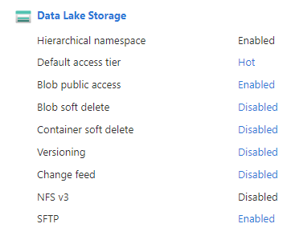

# Run AzCopy Tests Locally

In order to verify your changes locally, you should run all the available unit tests and e2e tests.

Please notice that not all of the tests are able to run locally, some of the tests can run only on windows / mac OS, these tests will be skipped.

## First step build:
run the above comnmands:

    set -e
    GOARCH=amd64 GOOS=linux go build -o azcopy_linux_amd64

this will create the azCopy execution file, If you want to run some manual tests - you can use it like this:

    azcopy_linux_amd64 cp "SourcePath" "destinaltionPath" --flag1 --flag2

## Before running the tests:
multiple tests use an azure storage account while running, in order to support that, you should create a storage account with the below configuration:
1. When creating the storage account, make sure that `Hierarchical namespace` feature is enabled.
2. Disable all the soft delete features.

make sure your account configurations looks like this: 

## Run the unit tests locally
1. Go to your storage account, copy the storage account name and access key
2. Run the below commands:

        set +e
        export ACCOUNT_NAME=<account name>
        export ACCOUNT_KEY=<account key>
        go test -timeout 60m -race -short -cover ./cmd ./common ./common/parallel ./ste ./azbfs ./sddl "-check.v" -v

Notice: not all the tests are currently running, multiple tests are broken under common and common/parallel, but the other tests should succeess, see test run example in the side notes:

# Run the e2e tests locally
The e2e tests currently runs against real Azure Storage as the other tests, but unlike the e2e tests use also non HNS storage accounts, and also perform contributor actions against this storage account. In order to allow that it requier some extra setups.
1. Create a storage account, make sure that `Hierarchical namespace` feature is _disabled_
2. Create An App registration - in the Azure portal go to Azure Active Directory, select App registration, and create new one, or use the existing one.
3. Create a new secret and copy its value immidatly (after a few minutes the value will not be available any more).
5. Assign StorageAccountContributor permissions to the app registration over the storage accounts
6. Run the script:

         ./run_e2e_test.sh

_note: currently most of the sync e2e test are failing_

Side Notes:
* Test run example:

        *OOPS: 28 passed, 2 skipped, 1 FAILED*
        *--- FAIL: Test (11.42s)*
        *FAIL*
        *coverage: 17.2% of statements*
        *FAIL    github.com/shyaler/azure-storage-azcopy/v10/common      11.477s*
        *FAIL    github.com/shyaler/azure-storage-azcopy/v10/common/parallel [build failed]*
        *ok      github.com/shyaler/azure-storage-azcopy/v10/ste 0.086s  coverage: 4.5% of statements*
        *ok      github.com/shyaler/azure-storage-azcopy/v10/azbfs       45.742s coverage: 54.3% of statements*
        *ok      github.com/shyaler/azure-storage-azcopy/v10/sddl        0.088s  coverage: 68.4% of statements*
        *FAIL*